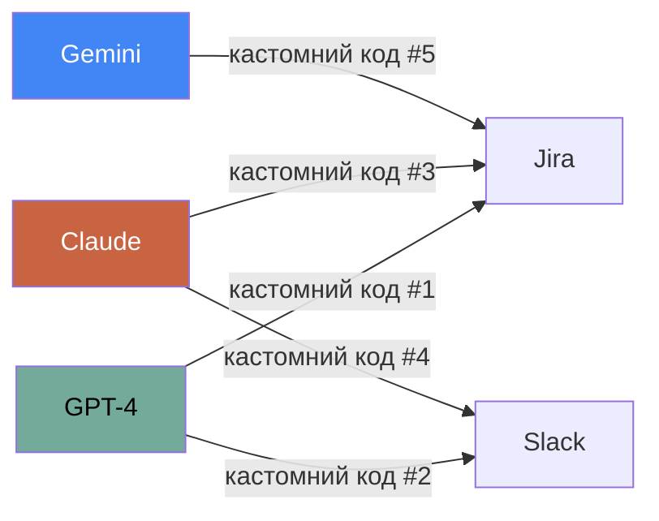
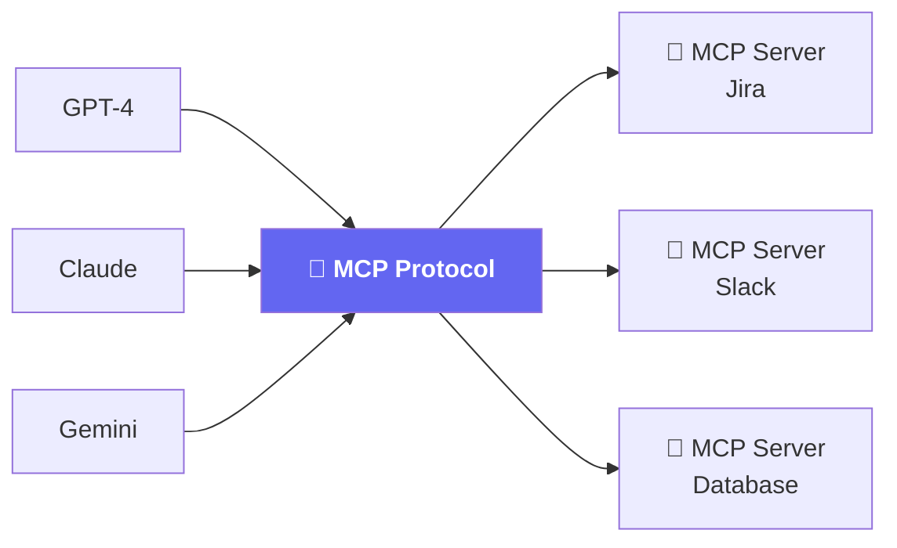

# Проблема: Integration Hell

_Кожна нова модель — нові інтеграції з нуля_

<!--
Починаємо з болю. Спитайте аудиторію: хто пробував підключити свій AI до зовнішніх даних?
Типова відповідь: "кожен раз пишемо кастомний код".
-->

---

# До MCP: N моделей × M інструментів

<v-click>

**3 моделі × 2 інструменти = 6 кастомних інтеграцій**

Кожна — своя авторизація, свій формат, ламається при оновленнях

</v-click>

<!--
"3 моделі × 2 інструменти" — це демо приклад.
Реальні системи мають 5+ моделей і 10+ інструментів = 50+ інтеграцій.
Кожна ламається незалежно. Кошмар підтримки.
-->

---

# MCP = USB-C для AI

<v-clicks>

- Написав сервер **один раз** → працює з будь-якою моделлю
- Підключив нову модель → вона одразу бачить **всі** сервери
- Спільнота вже написала **тисячі** готових серверів

</v-clicks>

<!--
Аналогія: USB-C замінив 6 різних зарядок. MCP робить те ж для AI інтеграцій.
"Написав сервер один раз" — це ключово для команд: не писати клей-код для кожної моделі.
-->

---

# Що таке MCP?

**Model Context Protocol** — відкритий стандарт від Anthropic (листопад 2024)

<v-clicks>

- 🌐 **Відкритий** — не прив'язаний до конкретної моделі чи компанії
- 📡 **JSON-RPC 2.0** — стандартний протокол повідомлень
- 🔌 **Plug & Play** — підключив сервер → модель одразу бачить інструменти
- 🏗️ **Клієнт-серверна** архітектура (як REST API, але для AI)

</v-clicks>

<v-click>

> Поточна версія: **2025-11-25**  
> Специфікація: `spec.modelcontextprotocol.io`

</v-click>

<!--
Важливо: MCP НЕ є офіційним стандартом IEEE/IETF, але де-факто став стандартом для AI інтеграцій.
Майже всі major IDE і AI-інструменти вже підтримують MCP (VS Code, Cursor, Cline, JetBrains...).
-->
