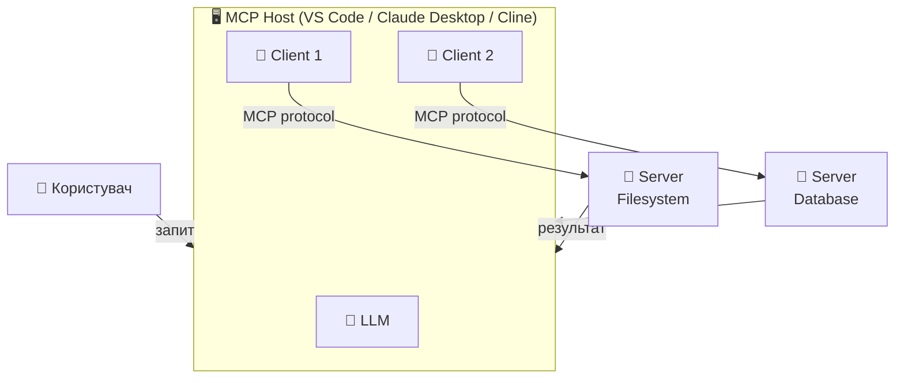

# Архітектура MCP

_Host · Client · Server_

<!--
Тут пояснюємо три ролі. Це ключова концепція — решта лекції будується на ній.
-->

---
mermaid:
  scale: 0.55
---

# Три ролі: Host, Client, Server

<!--
Ключова ідея: Host оркеструє все. Він знає і про LLM, і про всі сервери.
Клієнти — це просто з'єднання, по одному на кожен сервер.

---

❓ Питання: "Тільки одне з'єднання між клієнтом і сервером — хіба не можна більше?"

1 Client = 1 Server — це не обмеження протоколу, а архітектурний патерн.
MCP Server — це звичайний процес (stdio або HTTP), він підтримує довільну кількість
паралельних з'єднань. Host просто створює стільки Client-екземплярів, скільки потрібно.

Для stdio-сервера кожен Client = новий subprocess → кожен процес ізольований.
Для HTTP-сервера — кілька клієнтів підключаються до одного запущеного процесу.

❓ Питання: "Чи правильно в LangChain створювати окремого агента на кожного користувача?"

ТАК, це правильний підхід для multi-user сценаріїв.

Причини:
- Кожен LangChain-агент тримає власний chat_history → ізольований контекст
- Кожне MCPClient-з'єднання — окрема сесія з сервером (власний стан)
- Немає шансу "перетікання" даних між користувачами

Патерн:
  user_session[user_id] = {
    "client": MultiServerMCPClient(...),   # окреме з'єднання
    "agent": create_react_agent(llm, tools), # окремий агент
    "history": []                           # окрема історія
  }

При завершенні сесії — закрити client (await client.aclose()), щоб не тримати
зайві subprocess/HTTP-з'єднання відкритими.
-->

---

# Хто є хто

| Роль | Задача | Приклади |
|------|--------|---------|
| **🖥️ Host** | Запускає LLM, оркеструє, показує UI | VS Code, Claude Desktop, Cline, ваш додаток |
| **📡 Client** | З'єднання 1:1 з одним сервером | Вбудований в Host, не пишемо окремо |
| **🔧 Server** | Надає інструменти та дані | Filesystem, DB, GitHub, **ваш код** |

<v-click>

**Головне правило:**  
`1 Client = 1 Server`  
Але Host може мати скільки завгодно Clients → підключений до багатьох Servers

</v-click>

<!--
Питання до аудиторії: "що ми пишемо сьогодні?"
Відповідь: переважно Server. Іноді Client (для свого агента).
Host — це вже написані інструменти (VS Code, Claude Desktop).
-->

---

# Що ми пишемо сьогодні

**🖥️ Host**

VS Code, Cline — вже написані за нас

_Не пишемо_

**📡 Client**

Вбудований в Host або LangChain — бере на себе

_Не пишемо (LangChain зробить)_

**🔧 Server**

Наш кастомний сервер з інструментами

**Пишемо ми!**

<!--
Спрощення: сьогодні фокус на Server. Client буде через LangChain MCP Adapters.
-->
