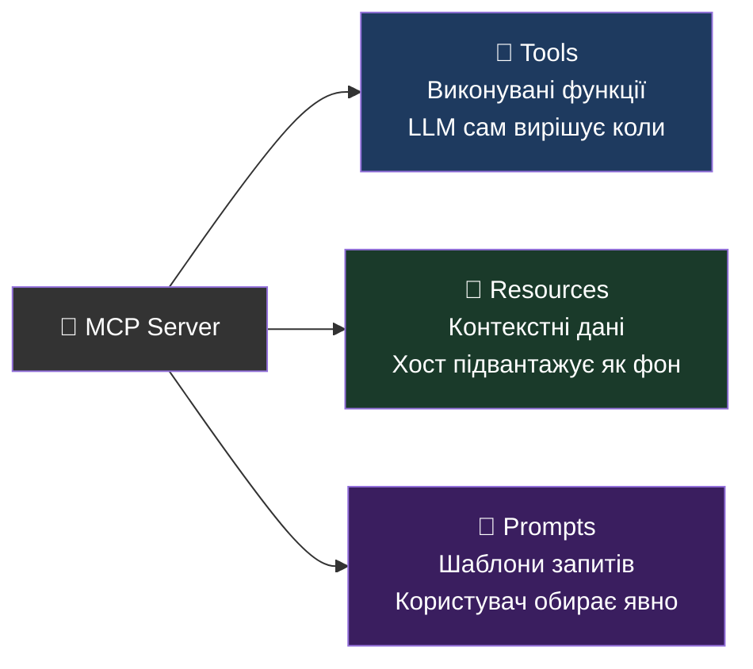

# Серверні Примітиви

_Що сервер може надати клієнту_

<div style="transform:scale(0.85); transform-origin:top center; margin-top:-4px; margin-bottom:-60px">



</div>

<!--
Три типи "контенту" який сервер може надати. Сьогодні фокусуємось на Tools.
Tools = "дієслова" (пошукай, видали, обчисли) — LLM сам вирішує коли викликати.
Resources = "іменники" (конфіг, документація, файли) — хост підвантажує як фон для LLM.
Prompts = "рецепти" (стандартизовані шаблони) — користувач вибирає в UI Claude Desktop / VS Code.
-->

---

# 🔧 Tools — виконувані функції

```js
import { McpServer } from "@modelcontextprotocol/sdk/server/mcp.js";
import { z } from "zod";

const server = new McpServer({ name: "math-server", version: "1.0.0" });
```

<div v-click="1">

```js
// 1. Сама функція — звичайний async JS
async function add({ a, b }) {
  return { content: [{ type: "text", text: String(a + b) }] };
  //                  ↑ MCP завжди повертає масив content-об'єктів
}
```

</div>

<div v-click="2">

```js
// 2. Реєструємо функцію як MCP tool
server.tool(
  "add",                                // ← назва: LLM викликає саме за нею
  "Складає два числа та повертає суму", // ← опис: LLM читає, вирішує КОЛИ викликати
  {
    a: z.number().describe("Перше число"),
    b: z.number().describe("Друге число"),
  },
  add                                   // ← функція з кроку 1
);
```

</div>

<div v-click="3">

> 💡 Модель **не бачить код** — тільки назву, опис і схему параметрів.  
> Чим точніший `.describe()` — тим краще AI вирішує який tool і коли викликати.

</div>

<!--
Це найважливіший примітив. Tools = "дієслова" — те що AI може ЗРОБИТИ.
Бібліотека: @modelcontextprotocol/sdk (офіційна від Anthropic).
Zod: використовується для опису та валідації вхідних параметрів — SDK генерує JSON Schema автоматично.

server.tool() сигнатура:
  server.tool(name, description?, paramsSchema, handler)
  description — опціональний рядок, але ЗАВЖДИ додавайте — це ключ до якості AI.

.describe() на кожному параметрі Zod — це те що LLM бачить в JSON Schema.
Без describe() модель може передати неправильні аргументи.

Ми використовуємо цей самий add tool протягом всього воркшопу.
Крок 1 — пишемо сервер з add.
Крок 4 — агент сам вирішує коли викликати add vs search_cars.
Крок 6 — той самий add але через HTTP транспорт.
-->

---

# 🔧 Tools — анотації та обробка помилок

```js
server.tool(
  "delete_file",
  "Видаляє файл",
  { path: z.string().describe("Шлях до файлу") },
  { annotations: { destructiveHint: true, idempotentHint: true } },
  async ({ path }) => {
    try {
      await fs.unlink(path);
      return { content: [{ type: "text", text: `Видалено: ${path}` }] };
    } catch (err) {
      return {
        content: [{ type: "text", text: err.message }],
        isError: true,   // ← LLM бачить помилку → може виправитись сам
      };
    }
  }
);
```

<v-click>

> `isError: true` — LLM **бачить** повідомлення і може retry або змінити підхід.  
> Якщо handler кидає `throw` — SDK ховає деталі від LLM (вона не знає що сталось).

</v-click>

<!--
ANNOTATIONS — підказки для UI та LLM:
  destructiveHint: true  — Claude Desktop показує попередження "це незворотня дія"
  idempotentHint: true   — повторний виклик з тими ж параметрами безпечний (PUT, не POST)
  readOnlyHint: true     — tool лише читає, не змінює стан (список, пошук)

Annotations не є enforcement — це підказки. LLM може їх врахувати або ні.
Корисно для UI хостів які показують попередження перед destructive операціями.

isError vs throw — КРИТИЧНО ВАЖЛИВО:
  throw → SDK конвертує в protocol-level error → LLM не бачить текст помилки → LLM "завис"
  isError: true → tool_result з позначкою error → LLM читає текст → може retry

Найпоширеніша помилка початківців: throw замість isError → LLM тупить бо не знає що сталось.
Правило: якщо хочеш щоб LLM зрозумів помилку — використовуй isError.
-->

---

# 📂 Resources — статичний ресурс

**Resource = іменований контент який хост підвантажує LLM як фон**

```
Tool → LLM САМА вирішує коли викликати (дієслово: "знайди", "видали")
Resource → ХОСТ вирішує що підвантажити як контекст (іменник: конфіг, документація)
```

**Фіксований URI** — контент не залежить від параметрів:

```js
server.registerResource(
  "app-config",
  "config://app",                        // ← URI: унікальна адреса ресурсу
  { title: "App Config", mimeType: "text/plain" },
  async (uri) => ({
    contents: [{ uri: uri.href, text: "DB_HOST=localhost\nPORT=3000" }]
  })
);
```

> **Типові use-cases:** конфіг додатку, документація API, інструкції для агента, шаблони.

<!--
Resources — це "іменований контент" який хост підвантажує в контекст LLM.
Відрізняється від Tool тим що хост/додаток вирішує що підвантажити, а не LLM.

Аналогія: Tool = кнопка (LLM натискає коли хоче). Resource = аркуш паперу (хост кладе на стіл).

VS Code і Claude Desktop можуть підвантажувати ресурси в system prompt автоматично.
LLM їх "бачить" як частину контексту і може посилатись на них у відповідях.

Найчастіше використовують:
  - Конфіг: параметри системи, feature flags, поточний стан
  - Документація: README, API docs, інструкції з безпеки
  - Живі дані: поточний статус сервісу, метрики, нещодавні події

URI схема — довільна. config://, file://, user://, db:// — будь-яка.
-->

---

# 📂 Resources — динамічний ресурс

**URI-шаблон** — вміст залежить від параметра в адресі:

_Use-case: профіль користувача, сторінка документації, рядок з БД_

```js
server.registerResource(
  "user-profile",
  new ResourceTemplate("user://{userId}/profile", {
    list: async () => ({           // ← клієнт може отримати список всіх ресурсів
      resources: [
        { uri: "user://123/profile", name: "Alice" },
        { uri: "user://456/profile", name: "Bob" },
      ]
    })
  }),
  { title: "User Profile", mimeType: "application/json" },
  async (uri, { userId }) => ({   // ← userId витягується з URI автоматично
    contents: [{ uri: uri.href, text: JSON.stringify({ userId, name: "Alice" }) }]
  })
);
```

<!--
ResourceTemplate — URI Templates (RFC 6570). {userId} витягується з URL автоматично.
Аналогія: як Express route params. "user://123/profile" → userId = "123".

list callback — дозволяє клієнту отримати список всіх доступних ресурсів (як ls в файловій системі).
Без list — клієнт може читати ресурс якщо знає URI, але не може "переглянути всі".

Приклади динамічних Resources:
  user://{userId}/profile  → профіль конкретного юзера
  doc://{section}/{page}   → сторінка документації
  db://orders/{orderId}    → замовлення з БД

БЕЗПЕКА: якщо URI mapped на файлову систему — ЗАВЖДИ санітизуйте шлях!
  Перевіряйте що resolved path залишається всередині дозволеної директорії.
  Ніколи не передавайте URI-змінні напряму в fs.readFile() без перевірки (path traversal attack).
-->

---

# 📝 Prompts — реєстрація шаблонів

**Стандартизовані шаблони які команда зберігає на сервері**

```js
server.registerPrompt(
  "review-code",
  {
    title: "Code Review",
    description: "Ревʼю коду на best practices",
    argsSchema: z.object({
      language: z.string().describe("Мова програмування (typescript, python...)"),
      code:     z.string().describe("Код для ревʼю"),
    }),
  },
  ({ language, code }) => ({
    messages: [{
      role: "user",
      content: { type: "text", text: `Review this ${language} code:\n\n${code}` }
    }]
  })
);
```

<v-click>

> **Use-case:** команда зберігає складний prompt ("code review", "write tests") —  
> всі натискають один шаблон замість писати його з нуля кожного разу.

</v-click>

<!--
completable() — обгортає Zod-поле та додає автодоповнення аргументів у клієнті.
Клієнти (VS Code, Claude Desktop) показують підказки при заповненні аргументів prompt.

argsSchema — Zod object, як і в server.tool().
messages — масив повідомлень, які підставляються в розмову.

Типовий use-case: стандартизувати складний multi-step prompt який команда використовує постійно.
Наприклад: "генерація тестів для функції" — не хочеш щоразу описувати правила і формат.

Різниця від Tool у контролі:
  Tool — LLM сама вирішує "чи потрібно викликати" і "з якими аргументами"
  Prompt — людина явно каже "хочу цей шаблон" і заповнює форму
-->

---

# 🛠️ Server instructions

**Підказки моделі про весь сервер** — крос-tool залежності та workflow:

```js
const server = new McpServer(
  { name: "db-server", version: "1.0.0" },
  {
    instructions:
      "Завжди викликай list_tables перед SQL запитами. " +
      "Використовуй validate_schema перед migrate_schema."
  }
);
```

> Клієнт може додати `instructions` у system prompt автоматично.  
> Не дублюй те, що вже є в описах окремих tools — пиши лише крос-tool логіку.

<!--
Server instructions:
  - Не дублювати те, що вже є в описах окремих tools.
  - Використовувати для крос-tool залежностей та workflow патернів.
  - Клієнт може додати це в system prompt.
-->

---

# 📊 Сповіщення (Notifications)

**Однонаправлені повідомлення без відповіді:**

<div grid="~ cols-2 gap-6">
<div class="text-sm">

**server → client:**
- `notifications/progress`
- `notifications/message`
- `notifications/cancelled`
- `notifications/tools/list_changed`
- `notifications/prompts/list_changed`
- `notifications/resources/list_changed`
- `notifications/resources/updated`

**client → server:**
- `notifications/roots/list_changed`

</div>
<div>

<v-click>

```js
// Progress:
await ctx.mcpReq.notify({
  method: "notifications/progress",
  params: { progressToken: token, progress: 3, total: 10 }
});

// Кастомна (власний протокол):
await ctx.mcpReq.notify({
  method: "custom/event",
  params: { status: "ready" }
});
```

</v-click>

</div>
</div>

<!--
Notifications — однонаправлені, не мають відповіді (fire-and-forget).
progressToken — присутній лише якщо клієнт надіслав у запиті. Завжди перевіряти на undefined.
roots/list_changed — єдина notification від client до server (хост повідомляє про зміну доступних директорій).
Кастомні notifications: будь-який рядок як method — корисно для власних протоколів між вашим сервером і клієнтом.
-->

---

# Клієнтські Примітиви

_Що сервер може попросити у клієнта_

<div grid="~ cols-3 gap-4 mt-4">

<div class="p-3 rounded border border-gray-600">

**🧠 Sampling**

Сервер просить LLM зробити доповнення. Сервер **сам не має LLM** — використовує модель хоста.

_Приклад:_ сервер аналізує лог → просить Claude "поясни цей stack trace"

</div>

<div class="p-3 rounded border border-gray-600">

**📁 Roots**

Межі файлової системи. Хост каже серверу до яких директорій він має доступ.

_Приклад:_ VS Code каже серверу "ти можеш читати тільки `/project/src`"

</div>

<div class="p-3 rounded border border-gray-600">

**❓ Elicitation**

Сервер питає у користувача коли потрібна додаткова інформація.

_Приклад:_ "Введіть API ключ для GitHub", "Підтвердіть видалення 42 файлів?"

</div>

</div>

<!--
Клієнтські примітиви — просунута тема. Сьогодні НЕ пишемо, але знати треба.

Sampling:
  Сервер не має свого LLM але може "думати" через модель хоста.
  Приклад: MCP сервер для code review просить Claude пояснити функцію.
  Це дозволяє будувати агентів навколо зовнішнього LLM.

Roots:
  Хост передає серверу список директорій до яких той має доступ.
  Сервер може перевірити roots перед читанням файлу.
  Безпека: сервер не може вийти за межі дозволених директорій якщо перевіряє roots.

Elicitation:
  Нова функція (2025). Дозволяє інтерактивні сценарії.
  Сервер може показати форму, попросити підтвердження, запитати секрет.
  Важливо: користувач бачить запит і може відмовити.
-->
