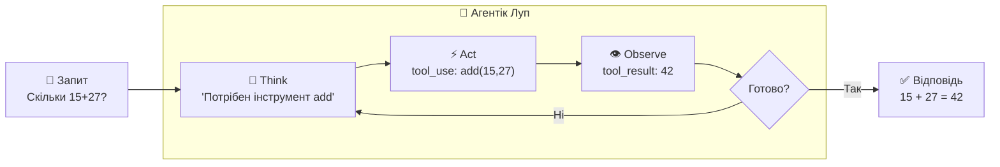
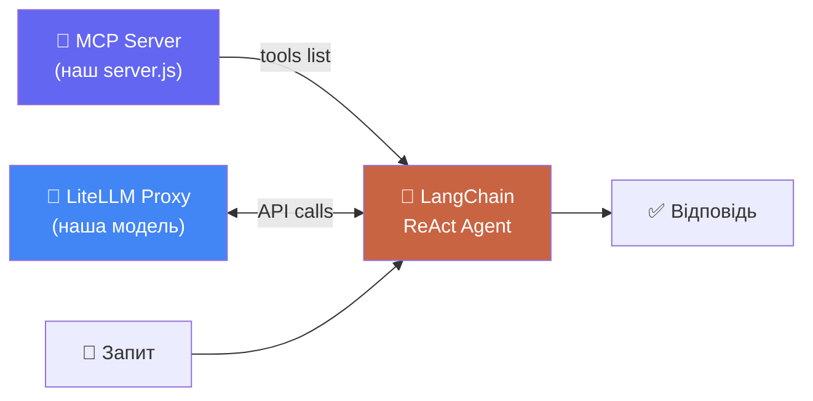

# Агентік Луп

_Як LLM вирішує що робити і коли_

<!--
Ключова теоретична частина. Без розуміння аgentic loop — незрозуміло навіщо взагалі MCP.
-->

---

# Проблема: LLM не може діяти

**LLM без інструментів:**

```
User: "Яка зараз погода в Києві?"
LLM:  "Я не маю доступу до реальних даних..."
```

<v-click>

**LLM з інструментами (MCP):**

```
User: "Яка зараз погода в Києві?"
LLM → викликає get_weather("Kyiv")
    ← отримує: { temp: 18, conditions: "Хмарно" }
LLM: "Зараз у Києві 18°C, хмарно."
```

</v-click>

<!--
Це ключова різниця: LLM з інструментами може ДІЯТИ, а не тільки відповідати.
-->

---

# ReAct: Think → Act → Observe

**Патерн ReAct** — єдиний стандартний патерн для AI агентів сьогодні:



<v-click>

**Як LLM фізично "зупиняється":**

| Крок | Що відбувається |
|------|----------------|
| 1. Think | LLM генерує токени... зупиняється на `tool_use` → СТОП |
| 2. Act | Framework виконує tool (ваш код, API, БД) — LLM чекає |
| 3. Observe | `tool_result` додається в контекст → LLM продовжує |

LangChain/LangGraph реалізує цей луп автоматично через `createReactAgent`.

</v-click>

<!--
ReAct = Reasoning + Acting. Класична стаття 2022 року (Yao et al., Google Brain).
"Think-Act-Observe" = природна мова як scratchpad для reasoning.

Як LLM зупиняється — деталі для тих хто питає:
  LLM генерує токен за токеном.
  Коли модель "вирішила" використати інструмент — вона генерує спеціальний токен tool_use.
  stop_reason = "tool_use" → API зупиняє стрімінг і повертає tool_use block.
  Framework (LangChain) бачить stop_reason → виконує tool → отримує result.
  Результат додається як tool_result message → API викликається знову з повним контекстом.
  LLM продовжує генерацію і або відповідає або знову викликає tool.

Це не "паузи" — це окремі API виклики. Кожен "раунд" = новий виклик LLM API.
Тому агент може зробити 5 tool calls = мінімум 6 API викликів (5 act + 1 final answer).

Чи є ReAct єдиний патерн? Є й інші:
  - Chain-of-Thought (CoT) — тільки думає, не діє (без інструментів)
  - ReAct — думає і діє (з інструментами) ← основний сьогодні
  - Multi-agent — кілька агентів делегують один одному (наступна лекція)
-->

---

# LangChain + MCP = Агент

**Без LangChain** — пишемо ReAct луп вручну (while True, перевіряємо stop_reason...)

**З LangChain** — `createReactAgent()` робить все:

<div style="transform:scale(0.82); transform-origin:top center; margin-top:-8px; margin-bottom:-70px">



</div>

<v-click>

LangChain реалізує ReAct луп автоматично. Нам: підключити MCP + передати запит.

</v-click>

<!--
Це ключовий "вау момент" — LangChain + MCP дає агента в ~15 рядках.
Покажіть що без LangChain код агенту займав ~40 рядків (while loop).
-->

