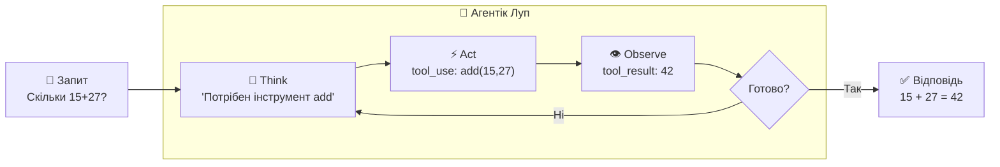

# Агентік Луп

_Як LLM вирішує що робити і коли_

<!--
Ключова теоретична частина. Без розуміння аgentic loop — незрозуміло навіщо взагалі MCP.
-->

---

# Проблема: LLM не може діяти

**LLM без інструментів:**

```
User: "Яка зараз погода в Києві?"
LLM:  "Я не маю доступу до реальних даних..."
```

<v-click>

**LLM з інструментами (MCP):**

```
User: "Яка зараз погода в Києві?"
LLM → викликає get_weather("Kyiv")
    ← отримує: { temp: 18, conditions: "Хмарно" }
LLM: "Зараз у Києві 18°C, хмарно."
```

</v-click>

<!--
Це ключова різниця: LLM з інструментами може ДІЯТИ, а не тільки відповідати.
-->

---

# ReAct: Think → Act → Observe

**Патерн ReAct** — основа агентік лупу:



<!--
ReAct = Reasoning + Acting. Класична стаття 2022 року.
LangChain реалізує цей патерн автоматично через create_react_agent.
-->

---

# LangChain + MCP = Агент

**Без LangChain** — пишемо луп вручну (while True, перевіряємо stop_reason...)

**З LangChain** — один рядок:

```
MCP Server → інструменти → LangChain Agent → LiteLLM → відповідь
```


<v-click>

LangChain сам реалізує Think-Act-Observe луп.  
Нам залишається: підключити MCP сервер і передати запит.

</v-click>

<!--
Це ключовий "вау момент" — LangChain + MCP дає агента в ~15 рядках.
Покажіть що без LangChain код агенту займав ~40 рядків (while loop).
-->

---

# Що таке LiteLLM Proxy

**LiteLLM** — API gateway який об'єднує різні LLM провайдерів під один OpenAI-сумісний API

```
LangChain              LiteLLM Proxy           Реальні моделі
ChatOpenAI     →    http://proxy:4000/v1   →   OpenAI GPT-4
(base_url=...)                             →   Claude
                                           →   Mistral
                                           →   Ваша кастомна модель
```

<v-click>

LangChain не знає що там "за" LiteLLM — він думає що спілкується з OpenAI.  
Ми просто міняємо `base_url` і `api_key`.

</v-click>

<!--
Якщо є питання "навіщо LiteLLM якщо є OpenAI SDK" -- пояснити:
1. Ми хочемо нашу внутрішню модель
2. LiteLLM дає єдиний інтерфейс для всіх моделей
3. Можна підключити будь-яку модель і не змінювати код агента
-->
