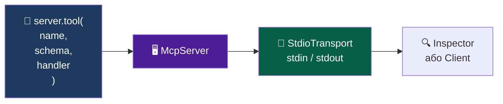

# 🖥️ Крок 1 — Перший MCP сервер

`workshop/01-server/server.js`

<!--
Відкрийте server.js на великому екрані.
Там є детальні коментарі — читаємо разом по частинах.
-->

---

# З чого складається MCP сервер



**Інструмент = 3 частини:**

| Частина | Що це | Навіщо |
|---------|-------|--------|
| `name` | рядок-ідентифікатор | LLM викликає по назві |
| `schema` | Zod-об'єкт з `.describe()` | LLM знає що передавати |
| `handler` | async функція | ваш бізнес-код |

<!--
Відкрийте файл і показуйте по частинах.
-->

---

# Запускаємо

```bash
# В папці workshop/
npm run server
# або: node 01-server/server.js

# Python версія:
python 01-server/server.py
```

<v-click>

**Порожній термінал = сервер чекає з'єднань ✅**

Сервер читає JSON-RPC з stdin і відповідає в stdout.  
Перевіримо через MCP Inspector у наступному кроці.

</v-click>

<!--
Покажіть що після запуску термінал "завис" — це нормально.
Сервер живе і чекає поки до нього підключиться клієнт або Inspector.

JS vs Python:
  JS:  server.tool(name, schema, fn) + StdioServerTransport + server.connect
  Python: @mcp.tool() + def + docstring + mcp.run()
Концепції ті самі, синтаксис різний. FastMCP ховає більше деталей.
-->
