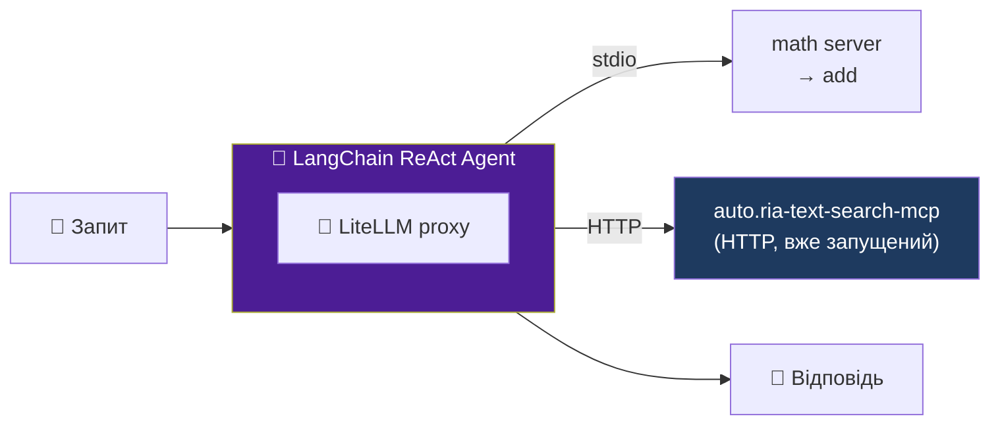
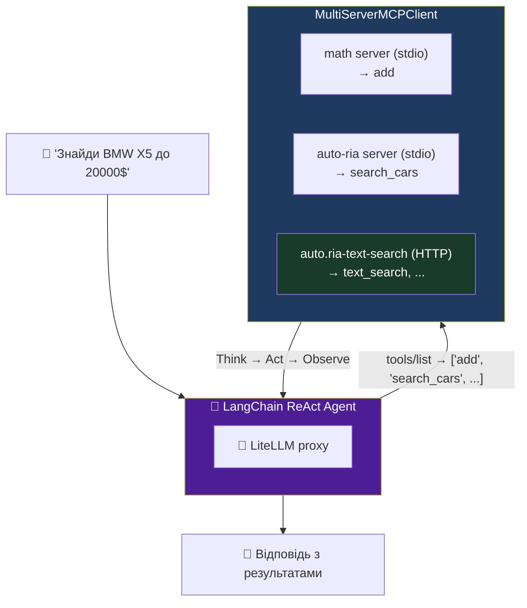

# 🧠 Крок 4 — LangChain агент + MCP сервери

`workshop/03-agent-loop/agent.js`  
`workshop/02-server/server.js`

<!--
Два файли відкриті паралельно.
Спочатку показуємо 02-server — що він робить, яка в нього структура.
Потім agent.js — як агент підключається до двох серверів.
Далі — підключаємо вже готовий production HTTP сервер через LiteLLM proxy.
-->

---

# Підключаємо готовий HTTP сервер

**auto.ria-text-search-mcp** — production MCP сервер, вже запущений:

<div style="transform:scale(0.9); transform-origin:top center; margin-top:-4px; margin-bottom:-40px">



</div>

> **auto.ria-text-search-mcp** — production MCP сервер (HTTP), студентам запускати не треба.  
> **LiteLLM proxy:** корпоративний шлюз — шарить доступ між командою і показує статистику.

<!--
auto.ria-text-search-mcp — вже запущений Production MCP сервер.
Студентам не треба його запускати — просто підключаємось через HTTP.
Покажіть LiteLLM proxy dashboard: /ui — там видно хто скільки tokens витратив.

Ключові моменти:
  1. MultiServerMCPClient може підключатись до stdio і HTTP серверів одночасно.
  2. HTTP сервер авторизація через Bearer token (MCP_SECRET в .env).
  3. LiteLLM proxy — OpenAI-compatible gateway що ховає реальний LLM endpoint.
-->

---

# Тестуємо AUTO.RIA сервер в Inspector

```bash
npm run inspect-search
```

<v-click>

В Inspector → Tools → `search_cars`:

```
query: "BMW X5 дизель до 20000 доларів"
limit: 3
```

Результат — список авто з повними деталями в одному запиті.

</v-click>

<!--
Покажіть Inspector з результатом пошуку.
Зверніть увагу: один виклик → пошук + деталі по кожному авто вже всередині.
-->

---

# Агент підключається до обох серверів

<div style="transform:scale(0.65); transform-origin:top center; margin-top:-24px; margin-bottom:-230px">



</div>

<!--
createReactAgent реалізує весь Think-Act-Observe луп автоматично.
MultiServerMCPClient об'єднує інструменти від ВСІХ серверів (stdio + HTTP) в один список.

Конфіг MultiServerMCPClient для HTTP сервера:
{
  mcpServers: {
    "auto-ria-text": {
      transport: "http",
      url: process.env.AUTO_RIA_SEARCH_MCP_URL,
      headers: { "Authorization": `Bearer ${process.env.MCP_SECRET}` }
    }
  }
}

Ключовий момент: агент отримує ОДИН список tools від всіх серверів.
Він не знає (і не повинен знати) звідки кожен tool — stdio чи HTTP.
-->

---

# Запускаємо

```bash
npm run agent
# або: node 03-agent-loop/agent.js
```

<v-click>

**В терміналі:**
```
Інструменти: ["add", "search_cars"]
[агент викликає search_cars з query="BMW X5 дизель до 20000 доларів"]
Ось результати: BMW X5 2018 року, дизель, 19 500$...
```

</v-click>

<v-click>

**Python:** `python 03-agent-loop/agent.py`

</v-click>

<!--
Під час виконання показуйте що агент:
1. Отримав список tools від обох серверів
2. Вирішив що для цього запиту потрібен search_cars
3. Отримав результат і сформулював відповідь

Можна спробувати: "Скільки буде 5 + 3?" — агент вибере add.
Можна спробувати: "Знайди Toyota Camry" — вибере search_cars.
-->

---

# Ізоляція per-user: окремий агент на юзера

**Проблема:** один агент для всіх → контексти мішаються, дані протікають

```js
// Зберігаємо окремий агент (+ history) для кожного user
const sessions = new Map();

async function getSession(userId) {
  if (!sessions.has(userId)) {
    const client = new MultiServerMCPClient({ mcpServers: { ... } });
    const tools = await client.getTools();
    sessions.set(userId, {
      agent: createReactAgent({ llm, tools }),
      history: [],   // ← окрема history розмови
    });
  }
  return sessions.get(userId);
}

// Використання:
const { agent, history } = await getSession(req.userId);
const result = await agent.invoke({ messages: [...history, userMessage] });
history.push(userMessage, result.messages.at(-1));
```

<!--
Per-user isolation — критично важливо для production агентів.

Без ізоляції:
  - Один user бачить дані іншого (якщо tools повертають дані з БД без фільтрації)
  - Контексти розмов мішаються
  - LLM "пам'ятає" попередні розмови інших users

З ізоляцією:
  - Кожен user = окремий agent instance + окрема history
  - MultiServerMCPClient запускається для кожного user окремо
  - Пам'ять очищується при logout або після timeout

Варіант 2 — простіший (але менш надійний):
  Передавати userId через system prompt і сподіватись що tools фільтрують самі.
  Проблема: LLM може ігнорувати системний промпт або tool може не фільтрувати.

Варіант 1 (код вище) — надійніший: ізоляція гарантована архітектурою.

УВАГА: при великій кількості users — думайте про cleanup (видаляти старі сесії).
sessions.delete(userId) при logout, або TTL через WeakRef/setTimeout.
-->
